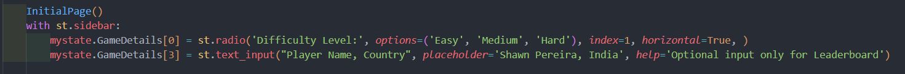

# Requistos vs código
## Requisitos Funcionales y Criterios de Aceptación

| Requisito y Criterios de Aceptación                                   | Código/Imagen                         |
|-----------------------------------------------------------------------|---------------------------------------|
| **1. Configuración de Nivel de Dificultad** **Requisito:** El sistema debe permitir a los jugadores seleccionar el nivel de dificultad antes de comenzar el juego. **Criterios de Aceptación:** - Opciones de dificultad fácil, medio y difícil disponibles para selección. - La configuración de dificultad debe influir en la mecánica del juego, como la frecuencia de regeneración de imágenes y la puntuación. - Tiempos de regeneración específicos:   - Fácil: cada 8 segundos.   - Medio: cada 6 segundos.   - Difícil: cada 5 segundos. |                    |
| **2. Inicialización del Tablero** **Requisito:** Al comenzar un juego, el sistema debe inicializar el tablero con un conjunto aleatorio de imágenes basado en la dificultad seleccionada. **Criterios de Aceptación:** - El tablero debe ser llenado con imágenes de emojis que corresponden a la dificultad elegida. - Ninguna imagen objetivo (emoji de la barra lateral) debe aparecer más de una vez en el tablero inicial. - La imagen objetivo debe ser seleccionada aleatoriamente y mostrada en la barra lateral. |                |
| **3. Parametrización del Nombre del Jugador y País** **Requisito:** El sistema debe permitir a los jugadores ingresar su nombre y país antes de comenzar el juego. **Criterios de Aceptación:** - Debe existir un campo de texto para que los jugadores ingresen su nombre y país. - Es posible que los campos de nombre y país estén vacíos, pero en ese caso no se muestra el _Leaderboard_ - La información del jugador debe persistir durante la sesión de juego. |   |
| **4. Gestión de tablero de juego** **Requisito:** El sistema debe generar, mostrar y gestionar un tablero de juego con casillas vacías que contengan emojis aleatorios. **Criterios de Aceptación:** - El tablero de juego debe generarse con la cantidad correcta de casillas vacías según el nivel de dificultad seleccionado. - Cada casilla del tablero debe mostrar un emoji aleatorio diferente.|   |
| **5. Selección de emojis** **Requisito:** El sistema debe mostrar un emoji de referencia en la barra lateral y asociar un emoji con cada casilla del tablero. **Criterios de Aceptación:** - El emoji de referencia debe mostrarse claramente en la barra lateral. - Cada casilla del tablero debe tener un emoji asociado aleatoriamente.|   |
| **6. Validación de respuestas** **Requisito:** El sistema debe mostrar un emoji de referencia en la barra lateral y asociar un emoji con cada casilla del tablero. **Criterios de Aceptación:** - El emoji de referencia debe mostrarse claramente en la barra lateral. - Cada casilla del tablero debe tener un emoji asociado aleatoriamente.|   |
| **7. Gestión de puntaje** **Requisito:** El sistema debe inicializar el puntaje del jugador en cero, incrementarlo por cada respuesta correcta y mostrar el puntaje actual en la pantalla. **Criterios de Aceptación:** - El puntaje del jugador debe inicializarse en cero al iniciar el juego. - El puntaje del jugador debe incrementarse por cada respuesta correcta.|   |
| **8. Control del Juego** **Requisito:** El sistema debe permitir al usuario iniciar y detener el juego, restablecer el tablero de juego y el puntaje del jugador, y mostrar un mensaje de victoria o derrota al final del juego. **Criterios de Aceptación:** - El usuario debe poder iniciar el juego haciendo clic en un botón o utilizando un atajo de teclado. - El usuario debe poder detener el juego en cualquier momento haciendo clic en un botón o utilizando un atajo de teclado.|   |
| **9. Interfaz de usuario** **Requisito:** El sistema debe proporcionar una interfaz de usuario atractiva, fácil de usar e intuitiva, utilizando elementos visuales como emojis e imágenes para representar el juego y proporcionando instrucciones claras sobre cómo jugar. **Criterios de Aceptación:** - La interfaz de usuario debe ser visualmente atractiva y utilizar colores y diseños que sean agradables a la vista. - La interfaz de usuario debe ser fácil de usar y navegar, con elementos intuitivos y una disposición lógica.|   |

