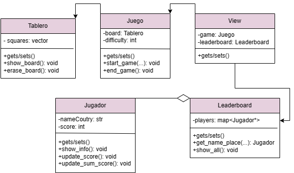

## Ayudas
A continuación verás algunos textos y preguntas que pueden ayudar en el proceso de identificación de las clases, métodos, atributos y relaciones para 
refactorizar el código del ejercicio

### Identificación de Clases Potenciales
Para identificar las clases, piensa en los "nombres sustantivos" que ves en la descripción del proyecto y en las funcionalidades que has observado:
- **Entidades Principales:** ¿Qué sustantivos se mencionan repetidamente? Ejemplo: en un juego, clases como `Jugador`, `Tablero`, `Juego` podrían ser centrales.
- **Grupos de Datos:** ¿Qué información se maneja conjuntamente? Esto podría indicar una clase. Por ejemplo, si se maneja nombre, puntaje, y nivel del jugador, una clase `Jugador` podría encapsular estos datos.
- **Agrupación lógica de funcionalidades**: Si partes del código siempre operan juntas o manejan la misma categoría de datos, probablemente deberían ser una clase. 
 - **Objetos y colecciones**
   - **Arreglos con Posiciones Específicas**
     - Si encuentras arreglos donde cada posición tiene un significado específico (por ejemplo, `datos[0]` siempre es el nombre, `datos[1]` es la dirección, etc.), es un indicativo claro de que esos datos podrían estar mejor representados como atributos de una clase. Acceder a los datos sería más legible y menos propenso a errores usando `objeto.nombre` y `objeto.direccion` en lugar de índices numéricos.

   - **Listas de Tuplas para Representar Objetos**
     - A menudo se utilizan listas de tuplas para representar una colección de objetos. Cada tupla contiene varios elementos relacionados, como por ejemplo, `(nombre, edad, salario)`. Este es un buen candidato para convertirse en una clase `Empleado`, donde cada instancia representa un empleado específico.

   - **Datos Agrupados que se Pasan Juntos**
     - Si pasas grupos de variables juntos a múltiples funciones, esto puede indicar que esos datos están estrechamente relacionados y serían más efectivos como una clase. Por ejemplo, si pasas información sobre un libro como título, autor y año a varias funciones, considera agruparlos en una clase `Libro`.
  
   - **Lógica Compleja que Manipula los Arreglos**
     - Si el código incluye manipulaciones complejas o repetidas de datos almacenados en arreglos o listas, encapsular esta lógica en métodos de una clase puede hacer el código más organizado, reusable y fácil de mantener.
   - **Extensión y Mantenimiento**
     - Si anticipas que los datos o las estructuras podrían expandirse en el futuro, usar clases hace que sea mucho más fácil añadir estas nuevas características sin perturbar el resto del sistema.

### Identificación de Métodos
Los métodos son acciones que las clases pueden realizar. Para definir métodos, busca "verbos" asociados con los sustantivos identificados:
- **Acciones Específicas:** ¿Qué acciones realiza cada entidad principal? Por ejemplo, un `Jugador` podría `incrementar_puntaje()`, `actualizar_nivel()`.
- **Funcionalidades del Sistema:** ¿Qué procesos y operaciones importantes necesita realizar el sistema? Ejemplo: `iniciar_juego()`, `verificar_seleccion()` en la clase `Juego`.
- Observa las tareas que se repiten en diferentes partes del código y que podrían ser centralizadas en un método de una clase
- **Funciones que operan sobre los mismos datos**: Cualquier función que modifique o utilice los mismos datos repetidamente es un candidato para ser un método de una clase. Por ejemplo, las funciones que modifican o leen el estado del juego (reset_board, update_score, check_game_end) podrían ser métodos de una clase Game.
- **Reutilización de código**: Si el mismo bloque de código se utiliza en múltiples funciones, considera convertirlo en un método dentro de una clase para mejorar la reutilización y la claridad

### Identificación de Atributos y Modificadores de Acceso
Los atributos son las características o propiedades de las clases, y los modificadores de acceso definen cómo se puede acceder a estos atributos:
- **Atributos:** Identifica qué información es fundamental para cada clase. Por ejemplo, la clase `Jugador` podría tener atributos como `nombre`, `puntaje`. 
- ¿Cuáles son los datos requeridos al momento de crear un objeto? estos a menudo se convierten en atributos de clase.
- **Modificadores de Acceso:** Decide quién necesita acceder a estos atributos. Utiliza `private` (privado) si solo la propia clase debe acceder a ellos. ¿Existen datos sensibles o críticos que deben ser protegidos de cambios externos?
- Variables compartidas entre funciones: Si varias funciones leen o modifican las mismas variables, esas variables son buenos candidatos para ser atributos de una clase. 
- Datos que definen el estado de un objeto: Cualquier dato que capture información sobre el estado de un sistema o de una entidad dentro de tu aplicación probablemente debería ser un atributo de una clase. Esto incluye configuraciones, contadores como puntajes o tiempos, y estados como el estado actual del juego.

#  Entregable - Mejoras para pasar a POO
Detalla en este markdown lo siguiente: 
- **Clases a Definir:** Enumera las clases que se podrían definir, describe sus propósito y justifica porque crees que es una clase útil para mejorar el programa.

**View**
**Propósito:** Tendrá toda la interacción con el usuario.
**Justificación:** Separa las funcionalidades del juego de la comunicación con el usuario.

**Juego**
**Propósito:** Abarca todo el juego en general, desde su lógica, hasta sus usuarios, sesiones, etc...
**Justificación:** Esto nos facilitará la parte modular del código, mejorando su expansión de nuevas funciones a largo plazo, la legibilidad y la eficiencia del mismo.

**Jugador**
**Propósito:** Hace de usuario, cada sesión nueva de cualquier usuario será un Jugador.
**Justificación:** Guardar atributos referentes a los datos del usuario, tal como su nombre, puntuación, etc...

**Leaderboard**
**Propósito:** Guarda las puntuaciones más altas de los usuarios.
**Justificación:** Facilitaría la manera de guardar los puntajes más altos, organizándolos de mayor a menor.

**Tablero**
**Propósito:** Administra y muestra los emojis.
**Justificación:** Tendría la información que tiene el tablero actualmente, tal como los emojis mostrados en él.

- **Métodos Importantes:** Enumera los métodos principales para cada clase. Incluye una descripción de cuál sería la utilidad de cada método

**Clase Juego**
**start_game(dificultad):** Empieza el juego y borra las cookies del usuario para empezar una sesión completamente desde 0.

**end_game():** Termina el juego borrando los datos de la sesión para que no hayan conflictos posteriores de las sesiones.

**Clase Leaderboard**
**show_board():** Muestra el tablero de juego.
**erase_board():** Borra el tablero completamente.

**Clase Jugador**
**show_info():** Mostrar toda la información de jugador.
**update_score():** Actualiza el puntaje.
**update_sum_score():** Actualiza el puntaje sumándolo al actual.

**Clase Leaderboard**
**get_name_place(num):** Muestra el usuario que está en _num_ lugar.
**show_all:** Muestra todos los usuarios en orden ascendente del leaderboard.

- **Imagen del UML del diagrama de clases**  Adjunta una imagen del UML del diagrama de clases como una forma visual de planificar y entender la estructura de las clases, métodos, atributos y relaciones que podría tener una versión mejorada del código fuente.

- **Organización de archivos:** Propon una estructura de organización de los archivos de este proyecto para que no queden todos en la raiz principal. Investiga cuáles podrían ser buenas formas de organizar los directorios y a partir de tu investigación indica qué directorios crearías y cómo los organizarías. 

**source/:**
  - Esta carpeta sería la general para el proyecto.

  --- **docs/:**
    - En esta carpeta habría un poco de documentación del proyecto y cómo utilizarlo.
  
  --- **functional/:**
  - En esta carpeta estarían los archivos funcionales tales como el .json que guarda el leaderboard, entre otros.

  --- **main/:**
  - En esta carpeta estarían todos los archivos relacionados con el funcionamiento del juego. Tales como board.py, leaderboard.py, player.py.

  --- **view/:**
  - En esta carpeta estarían los archivos que interactúan con el usuario tal como el view.py, main.py.

  --- **img/:**
  - En esta carpeta estarían los recursos gráficos.

  --- **venv/:**
  - Entorno de programación para desarrollar el proyecto.

-requirements.txt
